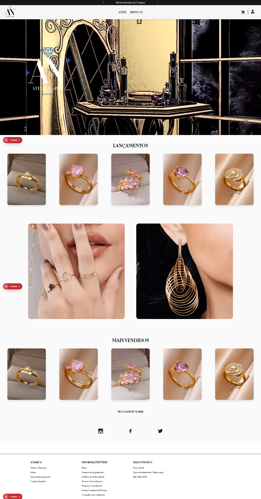

# 🛒 E-commerce Fullstack com Next.js, Prisma e NextAuth

Este é um projeto de e-commerce simples criado com foco em demonstrar habilidades técnicas em Next.js (App Router), autenticação com NextAuth.js, gerenciamento de banco de dados com Prisma, e funcionalidade básica de carrinho e checkout.

## 🔧 Tecnologias Utilizadas

- **Frontend:** Next.js 14 (App Router), TypeScript
- **Backend:** Prisma ORM
- **Autenticação:** NextAuth.js (email e senha ou google)
- **Banco de Dados:** SQLite (modo desenvolvimento)
- **Outros:** Tailwind CSS (opcional), Vercel (para deploy)

---

## ✨ Funcionalidades

- ✅ Cadastro de usuários
- ✅ Login com autenticação por e-mail e senha ou google
- ✅ Persistência de sessão com NextAuth
- ✅ Listagem de produtos
- ✅ Carrinho de compras associado ao usuário autenticado
- ✅ Simulação de pagamento / checkout

---

## 🖼️ Demonstração


---

## 🚀 Como rodar localmente

```bash
# Clone o projeto
git clone https://github.com/Josefs-stack/ecommerce.git
cd seu-repo

# Instale as dependências
npm install

# Configure o banco de dados e autenticação
cp .env.example .env

# Geração das tabelas com Prisma
npx prisma migrate dev

# Geração do cliente Prisma
npx prisma generate

# Rode o projeto
npm run dev
